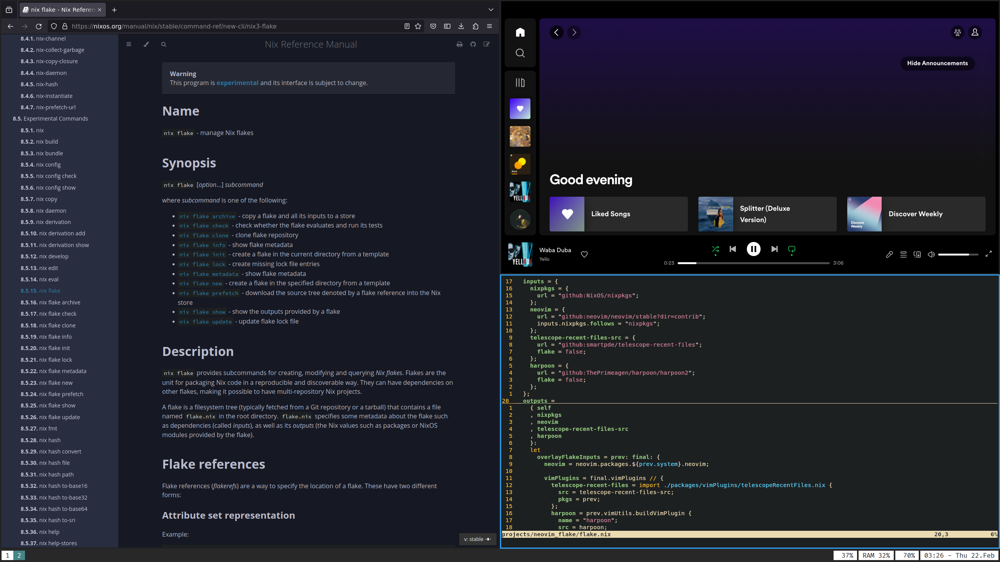

## nixOS flakes


[](https://garnix.io)




Have a look at the available flake outputs ~  
I would advice to checkout "ullr" first.  
"loki" and "server" were once more specialized and will certainly gain a more specific profil in the near future.

```console
$ nix flake show github:maff9n/nixos_flake
github:maff9n/nixos_flake/089f668915d1761124a2883308fe92d2efe3d91b
└───nixosConfigurations
    ├───loki: NixOS configuration
    ├───server: NixOS configuration
    └───ullr: NixOS configuration
```

Highly recommend using:
```console
$ nixos-rebuild switch --use-remote-sudo --flake <PATH>#<OUTPUT>
```

## Programs

The `home.nix` file contains details about all the software I use, but here's a brief outline.

| Type           | Program      |
| :------------- | :----------: |
| Editor         | [NeoVim](https://neovim.io/) |
| Launcher       | [Rofi](https://github.com/davatorium/rofi) |
| Shell          | [Kitty](https://sw.kovidgoyal.net/kitty/) |
| Status Bar     | [Polybar](https://polybar.github.io/) |
| Terminal       | [XTerm](https://invisible-island.net/xterm/) |
| Window Manager | [i3](https://i3wm.org/) |

### Overall Goals

Have all your shortcuts and favorite tools at hand - anywhere.  
Eliminate reliances on state for the machines in your care.  
New machine? New job? Machine got stolen? Minimize the downtime.
